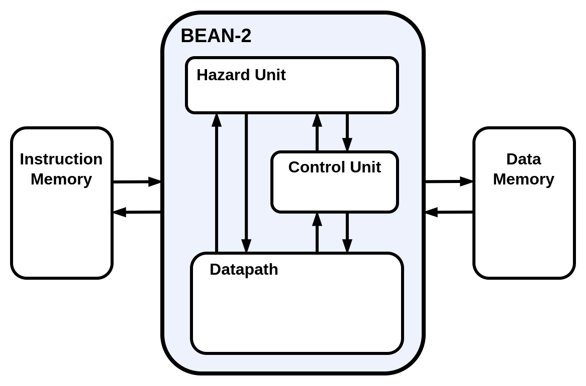
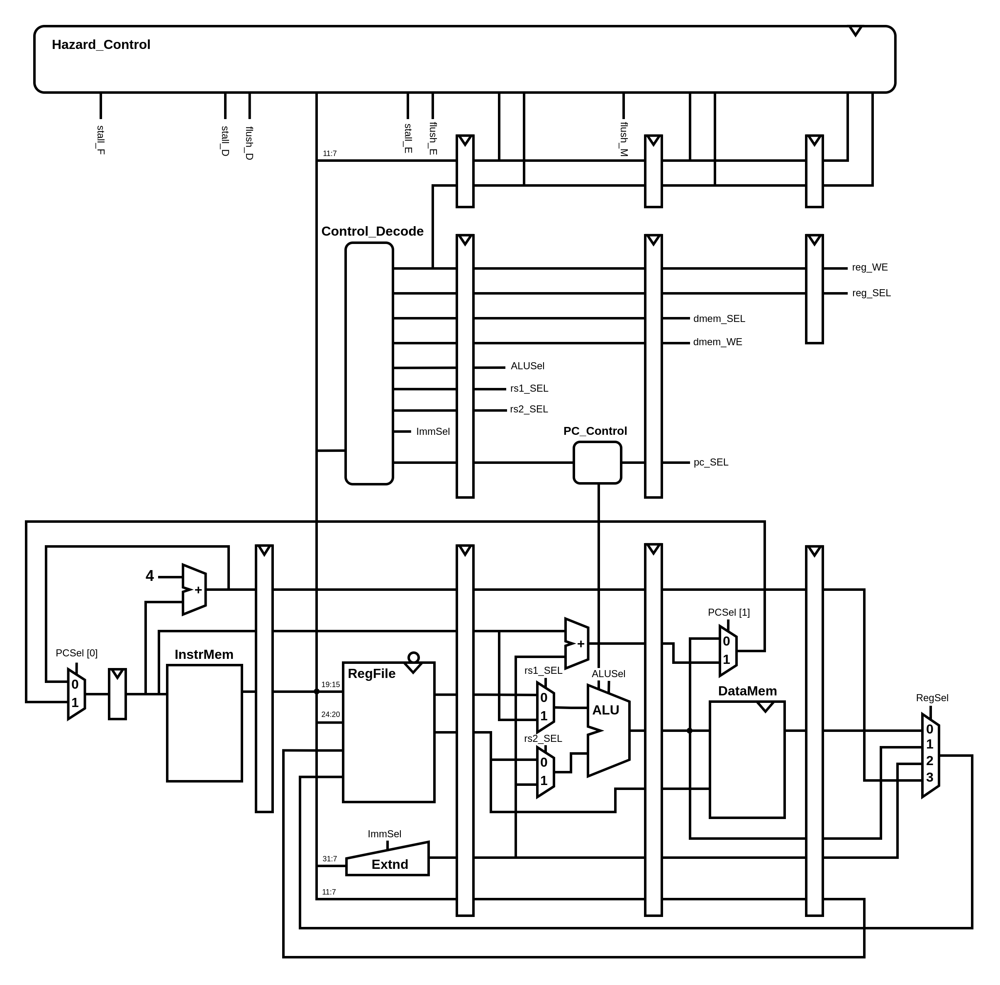

# BEAN-2

This project is an implementation of a five staged pipelined CPU utilizing the RISC-V ISA. The BEAN-2 is the next iteration from the BEAN-1 based off of the RV32I implementation as outlined in the [RISC-V Instruction Set Manual](https://riscv.org/wp-content/uploads/2017/05/riscv-spec-v2.2.pdf). Therefor making this a 32-bit cpu, written all in **Verilog**. This project was mostly made as a hobby and educational purposes, and I talk more about that and the design process [here on my website](https://brycekeen.com).

## BEAN-2 High Level Block Diagram

The BEAN-2 is broken down into three major components the *Datapath*, *Control Unit*, and the *Hazard Unit*. The *memory hierarchy* is separate in order to accommodate various memory configurations and implementations.
*

## BEAN-2 System Level Block Diagram

### Datapath

### Control Unit

### Hazard Unit

The **Hazard Unit** handles all pipeline hazards that might occur while in operation. The Hazard Unit implements two different tactics to handle these hazards -- flush and stall. Each pipeline stage is able to be independently flushed or stalled depending on the hazard encountered.

### Memory Configuration

The BEAN-2 follows a Harvard style architecture utilizing two independent memory caches, instruction and data memory. 

## Requirements

- A understanding of the RV32I implementation as referenced in the [RISC-V Instruction Set Manual](https://riscv.org/wp-content/uploads/2017/05/riscv-spec-v2.2.pdf) may help with understanding of this project.
- A Verilog synthesis tool is needed for this project such as [Icarus Verilog](https://steveicarus.github.io/iverilog/).
- GTKWave or a waveform viewer of your choice (All scripts are set up with GTKWave).
- 32 bit RISC-V Toolchain ([guide to build the toolchain](https://github.com/riscv/riscv-gnu-toolchain)) for more details on how to compile assembly or C refer to programs folder.

